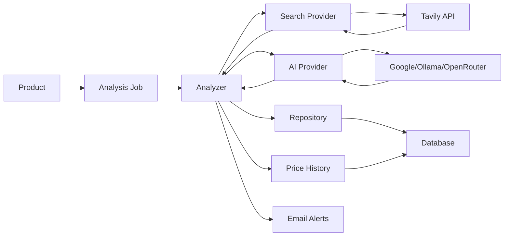

# Competitor Knowledge

[](https://php.net)
[](https://wordpress.org)
[](https://woocommerce.com)
[](LICENSE)

AI-powered competitor analysis for WooCommerce products. Automatically discover, track, and analyze competitor pricing and product information using advanced AI models and web search capabilities.

## 🚀 Features

### Core Capabilities
- **Multi-Provider AI Support**: Choose between Google Gemini, Ollama (local), or OpenRouter
- **Intelligent Web Search**: Powered by Tavily API for accurate competitor discovery
- **Automated Analysis**: Background processing using WooCommerce Action Scheduler
- **Price History Tracking**: Monitor competitor price changes over time with visual charts
- **Price Drop Alerts**: Email notifications when competitors offer better prices
- **Scheduled Analysis**: Automatic daily, weekly, or monthly competitor checks
- **Bulk Operations**: Analyze multiple products simultaneously
- **Secure API Key Storage**: Encrypted storage for sensitive credentials

### Technical Highlights
- **Modern PHP Architecture**: PSR-4 autoloading, strict typing, OOP design patterns
- **Dependency Injection**: Container-based service management
- **Interface-Driven Design**: Swappable AI and search providers
- **Comprehensive Testing**: PHPUnit tests with code coverage reporting
- **Code Quality**: PHPStan level 5, PHPCS WordPress standards compliance
- **Scalable**: Built for distributed systems and high-availability environments

## 📋 Requirements

- **PHP**: 7.4 or higher
- **WordPress**: 6.0 or higher
- **WooCommerce**: 8.0 or higher
- **Composer**: For dependency management
- **Node.js & npm**: For asset compilation

## 🔧 Installation

### 1. Clone or Download

```bash
cd wp-content/plugins/
git clone https://github.com/yourusername/competitor-knowledge.git
cd competitor-knowledge
```

### 2. Install Dependencies

```bash
# Install PHP dependencies
composer install --no-dev

# Install Node dependencies
npm install

# Build assets
npm run build
```

### 3. Activate Plugin

Navigate to **WordPress Admin → Plugins** and activate **Competitor Knowledge**.

## ⚙️ Configuration

### Initial Setup

1. Go to **Settings → Competitor Knowledge**
2. Configure your AI provider:
   - **Google Gemini**: Enter your Google AI API key
   - **Ollama**: Set your local Ollama URL (default: `http://localhost:11434`)
   - **OpenRouter**: Enter your OpenRouter API key
3. Enter your **Tavily Search API Key**
4. Configure notification settings (optional)
5. Enable scheduled analysis (optional)

### API Keys

#### Google Gemini
1. Visit [Google AI Studio](https://makersuite.google.com/app/apikey)
2. Create a new API key
3. Paste into the plugin settings

#### Tavily Search
1. Sign up at [Tavily](https://tavily.com)
2. Generate an API key
3. Paste into the plugin settings

#### OpenRouter (Optional)
1. Sign up at [OpenRouter](https://openrouter.ai)
2. Generate an API key
3. Paste into the plugin settings

#### Ollama (Optional - Local AI)
1. Install [Ollama](https://ollama.ai)
2. Pull a model: `ollama pull llama3`
3. Ensure Ollama is running locally

## 📖 Usage

### Manual Analysis

1. Navigate to **Products** in WordPress admin
2. Edit any WooCommerce product
3. Scroll to the **Competitor Analysis** metabox
4. Click **Run New Analysis**
5. View results including:
   - Competitor names and URLs
   - Price comparisons
   - Stock status
   - Comparison notes
   - Price history chart

### Bulk Analysis

1. Go to **Products** list
2. Select multiple products using checkboxes
3. Choose **Run Competitor Analysis** from bulk actions
4. Click **Apply**

### Scheduled Analysis

1. Go to **Settings → Competitor Knowledge**
2. Enable **Scheduled Analysis**
3. Select frequency (Daily, Weekly, Monthly)
4. Save settings

Analysis will run automatically in the background for all products with existing analyses.

### Price Alerts

Configure email notifications for price drops:

1. Set **Notification Email** in settings
2. Set **Price Drop Threshold** (percentage)
3. Receive alerts when competitors price below your threshold

## 🏗️ Architecture

### Directory Structure

```
competitor-knowledge/
├── src/
│   ├── AI/                    # AI provider implementations
│   │   ├── Contracts/         # AI provider interface
│   │   └── Providers/         # Google, Ollama, OpenRouter
│   ├── Admin/                 # WordPress admin integration
│   │   ├── Ajax.php          # AJAX handlers
│   │   ├── BulkActions.php   # Bulk operations
│   │   ├── Metaboxes.php     # Product metaboxes
│   │   └── Settings.php      # Settings page
│   ├── Analysis/              # Core analysis logic
│   │   ├── Jobs/             # Background job handlers
│   │   ├── Analyzer.php      # Main analysis orchestrator
│   │   └── AnalysisResult.php
│   ├── Core/                  # Plugin bootstrap
│   │   ├── Container.php     # DI container
│   │   ├── Encryption.php    # API key encryption
│   │   └── Plugin.php        # Main plugin class
│   ├── Data/                  # Data layer
│   │   ├── AnalysisCPT.php   # Custom post type
│   │   ├── AnalysisRepository.php
│   │   ├── Installer.php     # Database setup
│   │   └── PriceHistoryRepository.php
│   └── Search/                # Search provider implementations
│       ├── Contracts/         # Search provider interface
│       └── Providers/         # Tavily implementation
├── assets/                    # Compiled assets
├── assets-src/                # Source assets
│   ├── js/                   # JavaScript source
│   └── scss/                 # SCSS source
├── templates/                 # PHP templates
├── tests/                     # PHPUnit tests
├── vendor/                    # Composer dependencies
├── composer.json
├── package.json
├── phpunit.xml.dist
├── phpstan.neon.dist
└── phpcs.xml.dist
```

### Design Patterns

- **Dependency Injection**: Service container for loose coupling
- **Repository Pattern**: Data access abstraction
- **Strategy Pattern**: Swappable AI and search providers
- **Factory Pattern**: Dynamic provider instantiation
- **Interface Segregation**: Clean contracts for extensibility

### Data Flow



## 🧪 Development

### Running Tests

```bash
# Run all tests
composer test

# Run with coverage
composer coverage

# Generate HTML coverage report
composer coverage-html
```

### Code Quality

```bash
# Run PHP CodeSniffer
composer lint

# Auto-fix coding standards
composer fix

# Run PHPStan analysis
composer analyze
```

### Asset Development

```bash
# Watch for changes and auto-compile
npm run watch

# Build for production
npm run build
```

### Adding a New AI Provider

1. Create a new class in `src/AI/Providers/`
2. Implement `AIProviderInterface`
3. Register in `src/Core/Plugin.php` container
4. Add settings fields in `src/Admin/Settings.php`

Example:

```php
namespace CompetitorKnowledge\AI\Providers;

use CompetitorKnowledge\AI\Contracts\AIProviderInterface;
use CompetitorKnowledge\Analysis\AnalysisResult;

class CustomProvider implements AIProviderInterface {
    public function analyze(string $prompt, array $context): AnalysisResult {
        // Implementation
    }
}
```

## 🔐 Security

- **API Key Encryption**: All sensitive credentials are encrypted using WordPress salts
- **Nonce Verification**: All AJAX requests are protected
- **Capability Checks**: Admin-only access to settings and operations
- **Data Sanitization**: All inputs are sanitized and validated
- **Prepared Statements**: Database queries use `$wpdb->prepare()`

## 🐛 Debugging

Enable WordPress debug mode in `wp-config.php`:

```php
define('WP_DEBUG', true);
define('WP_DEBUG_LOG', true);
define('WP_DEBUG_DISPLAY', false);
```

Check logs at `wp-content/debug.log` for analysis errors.

### Action Scheduler Logs

View background job status:
1. Go to **WooCommerce → Status → Scheduled Actions**
2. Search for `ck_run_analysis` or `ck_scheduled_analysis`

## 📊 Database Schema

### Custom Tables

#### `wp_ck_price_history`
Stores competitor price history for charting and trend analysis.

| Column | Type | Description |
|--------|------|-------------|
| `id` | BIGINT | Primary key |
| `product_id` | BIGINT | WooCommerce product ID |
| `analysis_id` | BIGINT | Analysis post ID |
| `competitor_name` | VARCHAR(255) | Competitor identifier |
| `price` | DECIMAL(10,2) | Competitor price |
| `currency` | VARCHAR(10) | Currency code |
| `recorded_at` | DATETIME | Timestamp |

### Custom Post Types

#### `ck_analysis`
Stores analysis results and metadata.

**Meta Keys:**
- `_ck_target_product_id`: Associated WooCommerce product
- `_ck_status`: `pending`, `processing`, `completed`, `failed`
- `_ck_results`: JSON-encoded analysis results

## 🤝 Contributing

Contributions are welcome! Please follow these guidelines:

1. Fork the repository
2. Create a feature branch: `git checkout -b feature/amazing-feature`
3. Follow WordPress coding standards
4. Write tests for new functionality
5. Ensure all tests pass: `composer test`
6. Run code quality checks: `composer lint && composer analyze`
7. Commit your changes: `git commit -m 'Add amazing feature'`
8. Push to the branch: `git push origin feature/amazing-feature`
9. Open a Pull Request

## 📝 License

This plugin is licensed under the **GPL-3.0-or-later** license. See [LICENSE](LICENSE) file for details.

## 👤 Author

**Ahmad Wael**
- Website: [www.bbioon.com](https://www.bbioon.com)
- Email: ahmad@bbioon.com

## 🙏 Acknowledgments

- **Google Gemini**: For powerful AI analysis capabilities
- **Tavily**: For accurate web search results
- **Ollama**: For local AI model support
- **WooCommerce**: For the robust e-commerce platform
- **Action Scheduler**: For reliable background processing

## 📚 Resources

- [WordPress Plugin Handbook](https://developer.wordpress.org/plugins/)
- [WooCommerce Documentation](https://woocommerce.com/documentation/)
- [Google AI Documentation](https://ai.google.dev/docs)
- [Tavily API Documentation](https://docs.tavily.com/)
- [Ollama Documentation](https://github.com/ollama/ollama)

## 🗺️ Roadmap

- [ ] Support for additional AI providers (Anthropic Claude, OpenAI)
- [ ] Advanced filtering and search in analysis history
- [ ] Export analysis reports (PDF, CSV)
- [ ] Multi-currency support
- [ ] Competitor product matching confidence scores
- [ ] REST API endpoints for external integrations
- [ ] Dashboard widget with quick insights
- [ ] Comparison matrix view for multiple competitors

## ❓ FAQ

### Q: How often should I run competitor analysis?

**A:** It depends on your market dynamics. For fast-moving products, daily analysis is recommended. For stable markets, weekly or monthly may suffice.

### Q: Which AI provider should I choose?

**A:** 
- **Google Gemini**: Best overall accuracy and speed (requires API key)
- **Ollama**: Best for privacy and no API costs (requires local setup)
- **OpenRouter**: Access to multiple models (requires API key)

### Q: Are API keys stored securely?

**A:** Yes, all API keys are encrypted using WordPress authentication salts before storage.

### Q: Can I analyze products in bulk?

**A:** Yes, use the bulk actions dropdown on the Products page to analyze multiple products at once.

### Q: How do I view price history?

**A:** Edit any product and check the Competitor Analysis metabox. If multiple analyses exist, you'll see a price history chart.

---

**Made with ❤️ by [Ahmad Wael](https://www.bbioon.com)**
